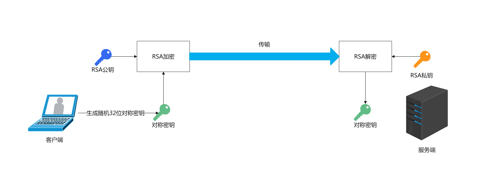
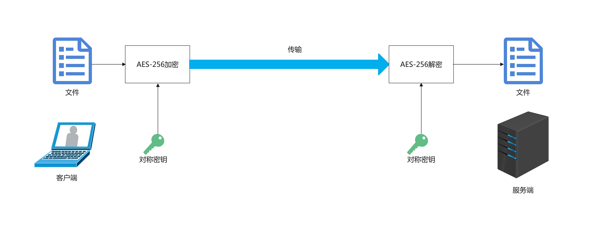

# 端到端文件传输加密

适用于没有HTTPS协议时的文件传输，如：个人家庭服务器

使用SpringBoot

注：由于采用Base64对文件编码，且未引入分块上传机制，文件大小超过50MB可能会引起崩溃。

[GitHub](https://github.com/jerryt92/file_e2e_encryption)

## 过程介绍

1. 从可靠来源（如：通过HTTPS访问的服务器）获取服务端的RSA公钥
2. 客户端随机生成一个32位的对称密钥，使用服务端RSA公钥加密后发送给服务端
3. 客户端使用对称密钥对文件加密后发送给服务端，服务端使用对称密钥解密（每个对称密钥经适用于一个文件）
